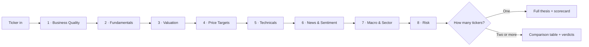

# 📈 Stock Analysis Skill

**Turn any ticker into a structured, multi-layer investment thesis — fundamentals, valuation,
technicals, price targets, sentiment, and risk — in one pass.**

[](LICENSE)
[](https://claude.com/claude-code)


A [Claude](https://claude.com/claude-code) skill that structures the equity-research process into a
consistent, repeatable framework. Ask about a stock and it runs the same 8-layer analysis every time,
assembling the result into a single investment thesis.

> ⚠️ **Not financial advice.** All output is for research and educational purposes only.

---

## Why this exists

Ad-hoc stock analysis is inconsistent — you go deep on the metrics you happen to remember and skip
the ones you don't. This skill enforces the same disciplined checklist on every ticker, so the
output is comparable across names and across time. It **structures the decision process, not the
decision itself** — you still apply your own judgment; the skill just makes sure nothing gets skipped.

## What it does

Ask Claude something like:

- `analyze AAPL`
- `is META a good buy?`
- `give me a deep dive on NVDA`
- `compare AMD vs NVDA vs INTC`

…and the skill runs an 8-layer framework on each ticker:



| # | Layer | Covers |
|---|-------|--------|
| 1 | **Business Quality** | moat, market position, insider ownership, management |
| 2 | **Fundamentals** | growth, profitability, balance sheet, earnings quality |
| 3 | **Valuation** | relative multiples, DCF range, reverse DCF, price-vs-own-history |
| 4 | **Price Targets** | consensus/high/low, analyst distribution, revision trend |
| 5 | **Technicals** | moving averages, RSI/MACD/Stochastic, ATR/Bollinger, Weinstein stage, entry/stop/target |
| 6 | **News & Sentiment** | recent headlines, insider activity, short interest, options positioning |
| 7 | **Macro & Sector** | sector trend, rate sensitivity, cycle positioning, institutional flow |
| 8 | **Risk** | business, regulatory, execution, valuation, macro, and technical risk |

### Single vs. multi-ticker

- **One ticker** → full 8-layer analysis + a single-ticker thesis block with a 1–5 scorecard.
- **Two or more tickers** → full analysis on each, a comparative snapshot table, and two explicit
  verdicts: **🏆 Best Buy Today** and **🏆 Best Long-Term Hold** (no "it depends" cop-outs).

## Sample output

<details>
<summary><strong>Click to expand — trimmed <code>analyze NVDA</code> thesis</strong></summary>

```
TICKER: NVDA — NVIDIA Corporation
Date: 2026-07-27
Price: $197.50 | 52-wk Range: $164.07–$236.54 | Market Cap: ~$4.77T

FUNDAMENTALS
Revenue (TTM): $215.9B | Growth: +65% YoY
FCF (TTM): $96.6B | FCF Margin: ~45%
Gross Margin: 71.1% | ROE: ~61% | ROIC: ~75%+
Net Debt: net cash positive

VALUATION
P/E (fwd): ~27x | P/FCF: ~49x | PEG (fwd): ~0.7
DCF: $165 bear / $215 base / $290 bull | Verdict: Fairly→modestly Undervalued

TECHNICAL SETUP
200 SMA ~$193 | 50 SMA ~$210 | RSI ~56 | Stage 2 (pullback to 200 SMA)
Entry $190–$197 | Stop ~$182 | Target $236 | R/R ~2.6:1

SCORECARD  Business 5 · Fundamentals 5 · Valuation 3 · Technicals 3 · Sentiment 4 · Conviction 4/5
```

*Illustrative, generated 2026-07-27. Not financial advice.*
</details>

**Full examples:**
- [Single ticker — NVDA](examples/single-ticker-NVDA.md)
- [Comparison — NVDA vs AMD](examples/comparison-NVDA-vs-AMD.md)

## Contents

| File | Purpose |
|------|---------|
| `SKILL.md` | The skill definition and full 8-layer framework |
| `examples/` | Real captured runs (single-ticker + comparison) |
| `references/valuation-formulas.md` | DCF, WACC, ROIC, PEG, reverse DCF, FCF yield + worked examples |
| `references/ratio-benchmarks.md` | Industry median ratios by sector (tech, financials, energy, REITs, utilities, staples, telecom…) |
| `references/technical-indicators.md` | Indicator definitions, a threshold cheat sheet, and interpretation rules |
| `references/red-flags.md` | Accounting & earnings-quality warning signs |

## Installing as a Claude skill

Clone the repo and place (or symlink) the folder into a directory Claude discovers as a skill source
— for example your personal skills folder:

```bash
git clone https://github.com/landenf/stock-analysis-skill.git
cp -r stock-analysis-skill ~/.claude/skills/stock-analysis
```

The skill activates automatically whenever a request involves analyzing, valuing, or comparing a
specific equity.

> **Note:** this repo is a standalone, shareable copy of the skill. If you also run the skill from a
> Claude-managed plugin directory, the two are independent — edits here won't sync there, and vice
> versa. Treat this repo as the source of truth and copy changes across deliberately.

## Scope

**Does:** 8-layer fundamental + technical + sentiment + price-target analysis, single and
multi-ticker comparison with explicit verdicts, valuation modeling (multiples + DCF range).

**Does not:** provide personalized investment advice, access live brokerage or real-time price feeds
(it uses web search), execute trades, size positions, or model options pricing.

## Disclaimer

This skill and its outputs are for **research and educational purposes only** and do **not**
constitute financial, investment, tax, or legal advice. Markets are risky; analyst targets are
opinions, not guarantees; and any figures produced may be stale or inaccurate. Do your own research
and consult a licensed professional before making investment decisions.

## License

[MIT](LICENSE)
